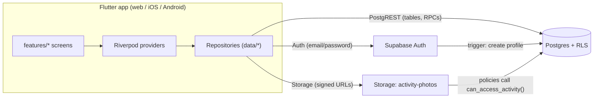
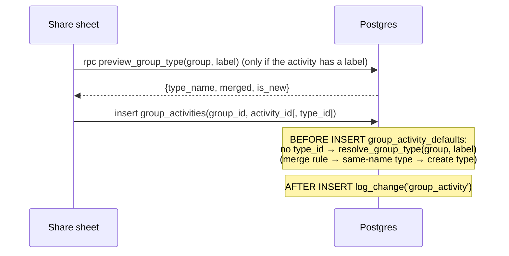

# Architecture

## Overview

There is no custom server. The Flutter app talks to Supabase directly, and **every rule is enforced in Postgres** through Row Level Security, column-level grants, triggers, and `security definer` functions (RPCs). The app does no access control of its own; at most it hides buttons that the database would reject anyway.

## Flutter app

### Layers

| Layer | Location | Responsibility |
|---|---|---|
| Entry | `main.dart` | `Supabase.initialize`, `ProviderScope`, Material 3 theme (light and dark) |
| Config | `config.dart` | Supabase URL and publishable key; defaults to local; overridable with `--dart-define` |
| Routing | `router.dart` | `go_router` routes, auth redirect, `ShellRoute` with the navigation shell |
| Data | `data/models.dart` | Plain immutable models with `fromJson`, plus select-column strings |
| Data | `data/*_repository.dart` | All Supabase calls, plus `FutureProvider`s exposing them |
| Features | `features/<area>/` | Screens, sheets and widgets for one area |
| Shared UI | `widgets/` | `AsyncBody`, `EmptyState`, prompt and confirm dialogs, snackbars |

### Routing

| Path | Screen | Notes |
|---|---|---|
| `/auth?next=` | `AuthPage` | Sign in or sign up. Signed-out users are redirected here with `next`, so invite links survive sign-in. |
| `/join/:token` | `JoinPage` | Previews and joins a group from an invite link. Outside the shell. |
| `/schedule` | `MySchedulePage` | List / Week / Month switch on all sizes; phones default to List, wide screens to Week. |
| `/groups` | `GroupsPage` | Groups list and pending invitations. |
| `/groups/:id` | `GroupPage` | Tabs: Activities, Schedule, Members, Types. |
| `/activities` | `ActivitiesPage` | My activities. |
| `/profile` | `ProfilePage` | Own profile, stats, account settings, sign out. |
| `/people/:id` | `PersonPage` | Someone else's profile; opened with `context.push` from members / "Going" lists. |
| `/activities/:id` | `ActivityDetailPage` | Any activity the user can see. Opened with `context.push` so Back returns to where you came from. |

`HomeShell` shows a bottom `NavigationBar` below 720 px wide and a `NavigationRail` above. It reads the current location from `GoRouter.routerDelegate`, so the highlighted tab is always correct.

Full-screen forms (`showActivityForm`) and bottom sheets are pushed on the **root** navigator, so they cover the navigation bar.

### Time zones

All times are stored in UTC (`timestamptz`) or as calendar dates. The app shows them in the user's **profile** time zone, not the device's: `AppClock` (in `data/app_clock.dart`) holds the display zone, converts server instants with `inZone`, builds user-picked times with `at`, and gives `today()`. `TimezoneController` loads the zone from the profile after sign-in and switches it when the user changes it; `scheduleProvider` watches `timezoneProvider`, so schedules refetch in the new zone. Sign-up sends the device zone in metadata; it is never overwritten automatically afterwards.

### State and refresh

- Reads are `FutureProvider` or `FutureProvider.family`, keyed by id (for example `groupActivitiesProvider(groupId)`).
- After a mutation, the code that made it **invalidates** the affected providers. Two helpers cover the common cases:
  - `invalidateActivity(ref, activityId, {groupId})`: my activities, that activity, where it's shared, its history, and group activity lists.
  - `invalidateLabels(ref)`: everything a label change can affect, including group types, because labels can create types.
- No realtime subscriptions yet. Other users' changes appear on refresh: pull-to-refresh, or re-entering a screen.

### Errors

Repositories throw `PostgrestException`, `AuthException` or `StorageException`. Screens catch them and call `showError`, which maps them through `friendlyError`:

| Postgres code | Shown as |
|---|---|
| 23505 unique violation | "That already exists." |
| 23503 foreign key | "It's still in use, so it can't be removed yet." |
| 42501 insufficient privilege (RLS, grants, guard triggers) | "You don't have permission to do that." |
| P0001 `raise exception` in RPCs | The exception message, e.g. "only the owner can delete this activity" |

## Backend security model

1. **RLS on every table.** Policies are written with `security definer` helpers, so they don't recurse through other tables' policies:
   - `is_group_member(group)` and `is_group_owner(group)`
   - `can_access_activity(activity)`: the owner, or a member of a group it's shared into
   - `shares_group_with(user)`, `entry_group(entry)`, `is_entry_participant(entry)`
2. **Column grants.** `update` is revoked on tables and granted only on editable columns. Clients can't change ownership, ids or bookkeeping columns, and can't move a schedule entry's time except through `reschedule_entry`, which checks for clashes.
3. **Insert-only through RPCs.** `group_members`, `schedule_entries`, `schedule_participants`, `notifications`, `change_log` and `type_merges` can't be inserted directly; the RPCs or triggers do it.
4. **Triggers do the bookkeeping.**
   - Profile creation on sign-up, group owner membership and starter types.
   - `updated_at` / `updated_by`, and the change log.
   - Reverting entries to events when an activity leaves a group.
   - Label filing and re-filing.
5. **Storage.** The private `activity-photos` bucket stores files at `<activity_id>/<file>`. Its policies call `can_access_activity` on the first path segment, and the app reads photos through 1-hour signed URLs.

Emails live only in `auth.users`. `profiles` is readable by all signed-in users but holds no email. Lookup by email (`find_user_by_email`) is exact-match only, so addresses can't be enumerated.

## Key data flows

### Sharing an activity into a group

### Changing or renaming a label

When `activities.personal_type_id` or `personal_types.name` changes, a trigger runs `resolve_group_type` for every group the activity is in. It sets `source_type_name` and `type_id`, which overrides any type a member chose by hand.

### Merging types

`merge_types(group, sources[], target_id | target_name)` does the following:
1. Creates the target if it's given by name.
2. Removes any rule that would redirect the target's own name.
3. For each source: upserts a rule `source.name → target`, re-points rules that targeted the source, moves the source's activities, and deletes the source type.

`remove_type_merge(rule)` deletes the rule and re-resolves the activities whose `source_type_name` matched it.

### Scheduling with clash checks

`create_schedule_entry(..., p_force)` first calls `find_clashes` for the chosen people.
- **Clashes and `p_force = false`:** it returns `{status: 'clash', clashes}` and saves nothing.
- **Otherwise:** it inserts the entry, marks clashing participants `status = 'clash'`, notifies them, and logs a `clash_override`.

All-day entries cover the whole day in each participant's `profiles.timezone`. Titles of entries in groups the caller isn't in come back as "Busy".

In the app, `EntryEditorPage` calls without force first; on a clash it shows `confirmClashes` and, if the planner proceeds, calls again with `p_force: true`. Lists come from `list_schedule`; the entry sheet watches the same `scheduleProvider(query)` as the list it was opened from, so it updates in place after each action.
